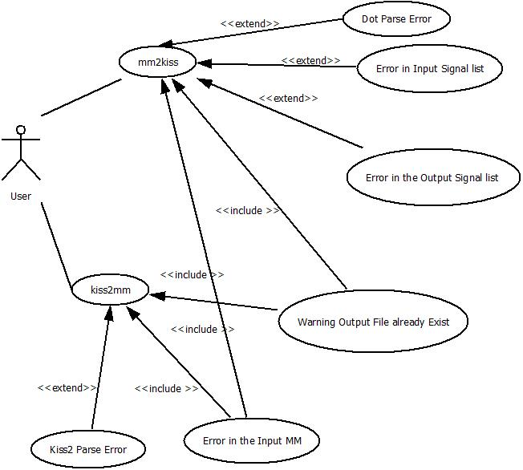
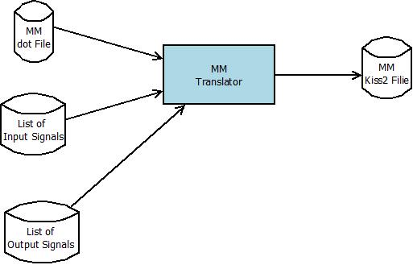
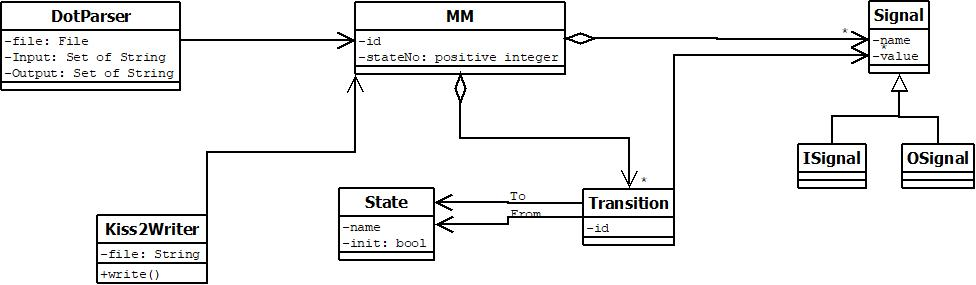
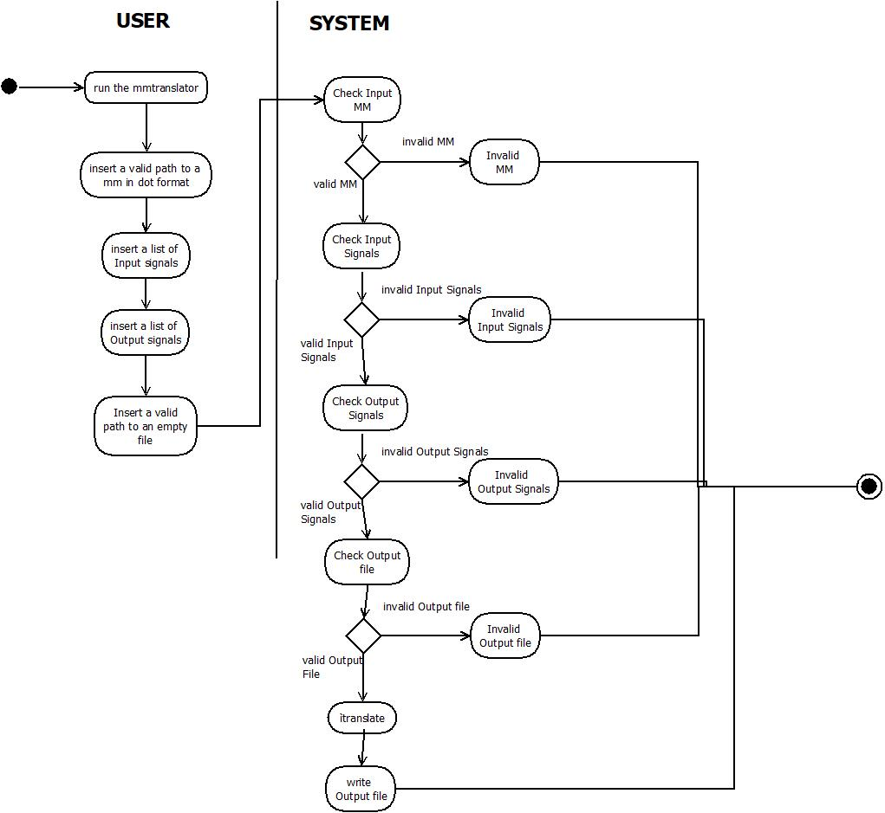

# Mealy Machine Translator

## Design Requirement Specification Document

DIBRIS – Università di Genova. Scuola Politecnica, Corso di Ingegneria del Software 80154

 <b> Authors </b>   Massimo Narizzano    

### REVISION HISTORY

| Version | Data | Author(s)| Notes |
| ---------|------|--------|------  |
| 1 | 12/04/23 | Massimo Narizzano | First Versionn of the document|
| 2 | 13/04/23 | Massimo Narizzano | Completed the second Use casem, added the Use case diagram|
| 3 | 03/05/23 | Massimo Narizzano | Added the UML Diagrams|

## Table of Content

1. [Introduction](#intro)
    1. [Purpose and Scope](#purpose)  
    2. [Definitions](#def)
    3. [Document Overview](#overview)
    4. [Bibliography](#biblio)
2. [Project Description](#description)
    1. [Project Introduction](#project-intro)
    2. [Technologies used](#tech)
    3. [Assumptions and Constraints](#constraints)
3. [System Overview](#system-overview)
    1. [System Architecture](#architecture)
    2. [System Interfaces](#interfaces)
    3. [System Data](#data)
        1. [System Inputs](#inputs)
        2. [System Outputs](#outputs)
4. [System Module 1](#sys-module-1)
    1. [Structural Diagrams](#sd)
        1. [Class Diagram](#cd)
            1. [Class Description](#cd-description)
        2. [Object Diagram](#od)
        3. [Dynamic Models](#dm)
5. [System Module 2](#sys-module-2)
   1. ...

##    1 Introduction

    
 The design specification document reflects the design and provides directions to the builders and coders of the product.
 
    Through this document, designers communicate the design for the product to which the builders or coders must comply. The design specification should state how the design will meet the requirements.

    
###  1.1 Purpose and Scope

 
    
 The objective of this project is to, given a file in a certain format which can be either DOT or KISS2, obtain the other one by having 
    at disposal a translator which parses the file in the given format and returns the very same file in the other respective format.

    
This sub section should describe ...

###  1.2 Definitions

 
    
 Put a summary of the section
    

    
This sub section should describe ...

    
| First Header  | Second Header |
| ------------- | ------------- |
| Content Cell  | Content Cell  |
| Content Cell  | Content Cell  |
    

###  1.3 Document Overview

 
    
 Explain how is organized the document
    

    
This sub section should describe ...

###  1.4 Bibliography

 
    
 Put a summary of the section
    

    
This sub section should describe ...

##  2 Project Description

###  2.1 Project Introduction 

 
    
  Describe at an high level what is the goal of the project and a possible solution
    

    
The goal of the project is to develop a translator of a MM in dot format into a kiss2 format. The system should take as input a file representing the MM in dot format, a list of Input signals, given for the order, as well as a list of output signals. As a result the system must output into a file the same MM with different format.
 

###  2.2 Technologies used

 
    
 Description of the overall architecture. 

    
Graphical representation of the system architecture.  May be composed by multiple diagrams depending on the differences in the environment
specifications    

###  2.3 Assumption and Constraint 

 
    
 Put a summary of the section
    

    
This sub section should describe ...

##   3 System Overview

    
 The user through the user interface should be able to translate a given MM as input. Here we show the use case diagram and some of the scenarios that must be implemented. Warning this is an example and may not be complete.
    

    

    
 ....

      
| Use Case      | 1.0           |
| ------------- | ------------- |
| Name          | mm2kiss       |
| Actors        | Generic User  |    
| Entry Point   | (i) MM dot file.   (ii) List of Input Signals   (iii) List of Output Signals   |
| Exit  Point   | File where  the translated MM must be stored |
| Event Flow    | (1) User invoke the system by command line   (2) User provide a valid path to an input MM in dot format   (3) User provide a list of symbols representing the input signals   (4) User provide a list of symbols representing the output signals   (5) User provide a valid path to an empty file where the system should store the output MM   (6) System validates the input MM   (7) System validates the list of input signals  (8) System valdiates the list of output signals   (9) System validates the output file   (10) System correctly parse the input file and store the MM in memory  (11) System write the MM in memory into the output file |
    
    
| Use Case      | 2.0           |
| ------------- | ------------- |
| Name          | kiss2mm       |
| Actors        | Generic User  |    
| Entry Point   | MM kiss2 file  |
| Exit  Point   | (i) File where  the translated MM must be stored.   (ii) List of Input Signals.   (iii) List of Output Signals |
| Event Flow    | (1) User invoke the system by command line   (2) User provide a valid path to an input MM in kiss2 format   (3) User provide a valid path to an empty file where the system should store the output MM   (4) System validates the input MM   (5) System validates the output file   (6) System correctly parse the input file and store the MM in memory  (7) System write the MM into the output file   (8) System write the list of Input Signal into the standard input.   (9) System write the List of output signals into the standard input| 

###   3.1 System Architecture

 
    
 In this section we describe the overll and high level structure of the system. In particular we describe all the modules that compose the system.
    

    
This system is composed by a single module that translate a MM in dot format into a kiss2 format

    
    
    

###   3.2 System Interfaces

 
    
 The system should use a command line interface.
    

    
Here we describe the syntax that the system must use. In particular we try to keep the syntax as simpler as possible. For this reason we define an interface like this:
    systemname "absolute path to the MM in dot format" "absolute path to the kiss2 file" "list of input signals separated by comma" "list of output signals separated by comma"

###   3.3 System Data

 
    
 In this section we describe the inputs and their format.    
    

####   3.3.1 System Inputs

 
    
 Here we describe the command line inputs of the sistem. 

  
 The inputs of the system are : 

    <ul> 
        <li> Absolute path to the input file: The file should not be empty and should describe a valid MM into a valid [dot](https://en.wikipedia.org/wiki/DOT_%28graph_description_language%29) Format.</li>
        <li> Absolute path to the output file: The file should be empty and it will contain the final result of the translation  </li>
        <li> List of string names separated by comma: They represent the input signal list. Each signal is represented by a string tha contains both letters and numbers. It should not contains any other symbol.</li>
        <li> List of string names separated by comma: They represent the output signal list. Each signal is represented by a string tha contains both letters and numbers. It should not contains any other symbol.</li>
    </ul>

####   3.3.2 System Ouputs

 
    
 Here we describe the command line output of the sistem. 

  
 The system has only one output and should be the translation of the MM from dot to kiss2 format. The translation should be written into the file given in input to the system.

##   4 Mealy Machine Translator

 
    
 Here we describe the structure of the system. 
    

    
First we describe the Static structure of the system, such as Class/Object Diagram, and then we describe the dynamic behaviour of the system. 

###   4.1 Structural Diagrams

 
    
 Here we describe two different type of view of the system, class and Object Diagram
    

####   4.1.1 Class diagram

 
    
 This section describe the class diagram of the system.
    

    

#####   4.1.1.1 Class Description

 
    
 Put a summary of the section
    

    
This sub section should describe ...

####   4.1.2 Object diagram

 
    
 Put a summary of the section
    

    
This sub section should describe ...

    

####   4.2 MM2Kiss translation

 
    
 
    In this section we define the dynamic model for mm to kiss translation
    

    
This sub section should describe ...

    

