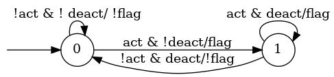

### User Requirements Specification Document
### Mealy Machine Translator
##### DIBRIS – Università di Genova. Scuola Politecnica, Software Engineering Course 80154

**VERSION : 1.3**

**Authors**  
Massimo Narizzano

**REVISION HISTORY**

| Version    | Date        | Authors      | Notes        |
| ----------- | ----------- | ----------- | ----------- |
| 1.0 | 27/02/2023 | Massimo Narizzano| Given a first description of the project. Completed section 1|
| 1.1 | 01/03/2023 | Massimo Narizzano| Completed section 2|
| 1.2 | 20/03/2023 | Massimo Narizzano| Added some requirements|
| 1.3 | 22/03/2023 | Massimo Narizzano| Modified section 2 with new informations|

# Table of Contents

1. [Introduction](#p1)
	1. [Document Scope](#sp1.1)
	2. [Definitios and Acronym](#sp1.2) 
	3. [References](#sp1.3)
2. [System Description](#p2)
	1. [Context and Motivation](#sp2.1)
	2. [Project Objectives](#sp2.2)
3. [Requirement](#p3)
 	1. [Stakeholders](#sp3.1)
 	2. [Functional Requirements](#sp3.2)
 	3. [Non-Functional Requirements](#sp3.3)
  
  

## 1. Introduction

This document is a simple example of a User Requirements Documents that is used as running example in the Software Engineering class at University of Genoa, course number 80154. It describes the functionality of a simple software that translate a Mealy machine from a format to another format.

### 1.1 Document Scope

This document is provided to the students of the SE-80154 course as an example of User Requirements documents. It shows how requirements can be written and which are the main errors in writing specifications. It may contains errors that are presents for didactical reasons. 

### 1.2 Definitios and Acronym

| Acronym				| Definition | 
| ------------------------------------- | ----------- | 
| SE23                                  | Software Engineering course, 2023 at university of Genoa|
| SE-80154                              | Software Engineering course, 2023 at university of Genoa, 80154 is its ID number|
| MM                                    | [Mealy Machine](https://en.wikipedia.org/wiki/Mealy_machine) is formalism used to synthetize models of systems|
| DOT                                   | [Graph Description language](https://en.wikipedia.org/wiki/DOT_%28graph_description_language%29) Is a text language used to describe graphs.|
| GRAPHVIZ                              | [Graphviz](https://www.graphviz.org/) is open source graph visualization software. Can be used to visualize the MM in DOT format|
| KISS                                  |[Kiss2 format](https://automata.cs.ru.nl/BenchmarkCircuits/Kiss) |
| MNcomp                                |Is the client. |
| OldChip Company                       |Is the company that produces *old* generation chips|
| NewChip Company                       |Is the company that produces  *new* generatio chips|
| OldChip Designer                      |Is a tool used to design MM for the chips produced by OldChip company|
| NewChip Designer                      |Is a tool used to design MM for the chips produced by NewChip company|

### 1.3 References 

1. [Mealy Machine](https://en.wikipedia.org/wiki/Mealy_machine)
2. [DOT](https://en.wikipedia.org/wiki/DOT_%28graph_description_language%29)
3. [Graphviz](https://www.graphviz.org/) 

## 2. System Description

In this document we describe the functionalities of a system that translate a mealy machine, essentially a graph, from a format to another. At the moment two are the format known, dot format and kiss format. So the idea is to develop a software that can read a format in input and translate the MM in the other format. 

### 2.1 Context

MNcomp is an enterprise that programs chips for machines used in our daylife, i.e. Washing or Dishwasher machines. MNcomp does not produce the chip by itself, rather it buy programmable chips from another company called OldChip Company. In order to program these chips the MNcomp employees use a tool called OldChip Designer that allows a user to draw a Mealy Machine (MM) that is used to control the chip's behaviour. OldChip designer is a tool that has been developed by OldChip company and provided as it is to the MNcomp. Once the MM is designed can be saved into a text file having a proper format called dot format. This MM in dot format is then loaded into the chip that is then ready to be used.

Mealy machines are Deterministic Finite State Automata that have also output at any tick of the clock. Modern CPUs, computers, cell phones, digital clocks and basic electronic devices/machines have some kind of finite state machine to control it. Simple software systems, particularly ones that can be represented using regular expressions, can be modeled as finite state machines. There are many such simple systems, such as vending machines or basic electronics.
[Mealy Machines](https://en.wikipedia.org/wiki/Mealy_machine) are a type of automata that are uesd to model some kind of Embedded Systems. They can be described as a finite-state machine whose output values are determined both by its current state and the current inputs. In figure can be found a visual example of a Mealy machine.

It represents a system with two states (0,1) and three variables : act, deact are input boolean signals while flag is an output boolean signal. Each arrow on the graph represents the relations between input and output signals. So for example on state 0 the self arrow has the label (!act & !deact / !flag) meaning that if the system is on state 0 and both the imput signals (act,deact) are false then the output signal must be set to false.

### 2.2 Motivations (what is the problem?)
Nowadays there is a lot of competition between chips producers. So Another chip cames into play and look very promising for MNcomp. This new chip is produced by NewChip company. The chip produced by NewChip company has some important and usefull functionality, such that the MNcomp decide to use it in its new generation machines. The new chip can be also programmed by a MM, so it should not be so difficult to migrate from old chips to new ones, and the entire desing process looks equivalent to the process used for  old chips: NewChip company provide a tool called  newchip designer that allows a user to design a MM. The tool allows to export (save) the MM into a text file that can be loaded into the new chips. The two designer tools are very different in the  user interface, but they are equivalent, you can design equivalent MM usign both tools. However in order to use the new chips the employees of the MNcomp must learn the NewChip designer tool. Since the MM are equivalent, and the entire process is equivalent, the Head of the MNcomp wants that the company employees use the OldChip Design tools, so it can save some money.

Unlucly the two tools export the same MM into a text file but with different formats: the OldChip Designer export a MM into a [dot](https://en.wikipedia.org/wiki/DOT_%28graph_description_language%29) format, while NewChip designer into a [Kiss2 format](https://automata.cs.ru.nl/BenchmarkCircuits/Kiss). In other word it looks that a MM deigned with OldChip designer tool can not be directly loaded into the new Chips, it has to be re-designed with the NewChip designer tools.

### 2.2 Project Objectives 

The project objective is to provide a tool that allows MNcomp employees to create MM using the old tool that can also be loaded by new chips. The idea is to have a tool that can read a dot file and traslate it into a kiss2 file, and viceversa. However the Kiss2 file format mantains information about variables,i.e. if a signal is an input or an output variable. 

## 3. Requirements

| Priority | Definition | 
| --------------- | ----------- | 
| M | **Mandatory:**   |
| D | **Desiderable:** |
| O | **Optional:**    |
| E | **future Enhancement:** |

### 3.1 Stakeholders

### 3.2 Functional Requirements 

| ID | Description | Priority |
| --------------- | ----------- | ---------- | 
| 1.0 |  The system should take as input a valid path to a to a file where a MM is stored in dot format | |
| 2.0 |  The system should take as input a list of signal names representing the input signal of the MM| |
| 3.0 |  The system should take as input a list of signal names representing the output signal of the MM| |
| 3.1 |  The input/output signals should have an unique name| |
| 3.2 |  The input/output signals should occur in the input file | |
| 4.0 |  The system should take as input a valid path to a to a file where the translation should be written | |
| 5.0 |  The system should convert the MM in input from the dot format to a Kiss2 format | |
| 6.0 |  The system should take as input a valid path to a to a file where a MM is stored in kiss2 format | |
| 7.0 |  The system should convert the MM in input from the kiss2 format to a dot format | |
| 7.1 |  If the MM is in the kiss2 format, the system should also provide in output the input/output signal list | |

### 3.2 Non-Functional Requirements 
 
| ID | Description | Priority |
| --------------- | ----------- | ---------- | 
| 1.0 |  The System should have the possibility to be runned by command line| |
| 2.0 |  The System should be multiplatform| |

| 1.0 | XXXXX |M|
